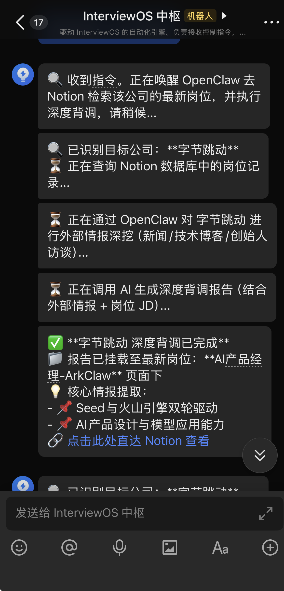
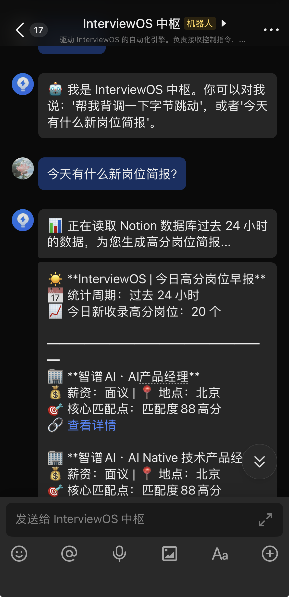

# 🎯 Job Engine — AI 驱动的智能岗位抓取与匹配引擎

> **自动抓取 BOSS直聘 / 猎聘 / 字节跳动 / 小红书 / DeepSeek / 月之暗面 / 智谱AI / MiniMax / 阿里巴巴 → DeepSeek AI 匹配评估 → Notion 同步 → 飞书 ChatOps 中枢（按需抓取 / 今日简报 / 深度背调）**  
> 专为 AI 产品经理（AI PM）求职场景设计；**日常调度推荐通过飞书网关触发**，避免本地 Cron 并发导致 OOM。


---

## 🚀 JobMonitor: 基于 AI 驱动的职业情报哨兵系统

JobMonitor 是一个专门为 **AI 产品经理** 打造的高频职业机会捕捉系统。它不仅仅是一个爬虫，而是一套集成了自动化采集、防封禁策略、大模型深度评估、结构化数据同步、飞书实时推送的个人招聘操作系统（InterviewOS）后端引擎。

---

## 🌟 项目亮点 (Key Highlights)

- **拟人化对抗策略**：针对招聘平台严苛的风控（如猎聘账号异常验证），集成了 Jitter Sleep（随机休眠）、模拟人类滚动浏览等行为指纹，有效延长账号爬取周期。
- **多模态 JD 解析**：自适应企业直招（`/job/`）与猎头代理（`/a/`）两种完全不同的页面 DOM 结构，确保 100% 提取完整岗位职责，拒绝低价值摘要。
- **全局去重 (Deduplication)**：基于"纯净 URL"哈希的全局去重机制，确保同一岗位在不同日期仅被处理一次，极致节省 DeepSeek API Token 成本。
- **AI 深度评估器**：利用 DeepSeek-V3 对 JD 进行 0-100 分匹配度测评，自动提取岗位亮点、入职风险及面试建议。
- **多平台覆盖**：支持 **9 大招聘渠道**（BOSS直聘、猎聘、字节跳动、小红书、DeepSeek、月之暗面、智谱AI、MiniMax、阿里巴巴），统一数据模型。
- **飞书 ChatOps 中枢**：`feishu_gateway.py` WebSocket 长连接，底部快捷菜单 + 文本指令；统一路由采集 / 简报 / 背调 / AI 资讯（转发 Node）。
- **OpenClaw 溯源背调**：自然语言带公司名才唤醒；`job-insight` 强制 web 检索；报告写 Notion、飞书只推摘要。
- **今日简报**：按 Notion **入库时间** 筛选过去 24 小时岗位，**不限匹配分数**；早报可引导继续 OpenClaw 背调。
- **全链路总调度**：`master_scheduler.py` / `scheduler.py` 仍可命令行一键触发「抓取 → 同步 → 早报」。

---

## 🏗️ 系统架构 (Architecture)

```
数据采集层
  ├── DrissionPage 接管本地 Chrome（BOSS直聘 / 猎聘）
  ├── Playwright 有界面浏览器（官网 7 家 + 字节跳动）
  └── requests API 直连（腾讯，可选）

逻辑控制层
  ├── Risk Control Interceptor（风控拦截器）
  ├── 拟人化行为模拟（随机休眠、平滑滚动、鼠标轨迹）
  └── 降级抓取策略（CSS 失效 → inner_text 全文兜底）

智能评估层
  └── DeepSeek API 5 维匹配评分（匹配度 / 薪资 / 地点 / 发展 / 团队）

数据展示层
  ├── Notion API 同步（URL 去重 + 增量更新）
  ├── 飞书 ChatOps 网关（按需抓取 / 今日简报 / 深度背调）
  └── Electron 可视化看板（地图分布 + 评分统计）
```

---

## 📋 项目概览

Job Engine 是一个**端到端的智能求职辅助工具**，核心流程如下：

```
招聘网站列表页
    │
    ▼
┌──────────────────────────────────────────────────────────────────┐
│  ① 多平台爬虫（9 大渠道）                                        │
│     - BOSS直聘 / 猎聘（DrissionPage 自动化浏览器）                │
│     - 字节跳动 / 小红书 / DeepSeek（Playwright 有界面浏览器）      │
│     - 月之暗面 / 智谱AI / MiniMax / 阿里巴巴（Playwright + Moka）   │
│     - 拟人化行为模拟（随机休眠、平滑滚动、防反爬）                  │
│     - 产品经理关键词过滤 + 公司黑名单过滤                          │
│     - 全局去重（本地 JSON 缓存 + URL 主键）                       │
└──────────────────────────────────────────────────────────────────┘
    │
    ▼
┌──────────────────────────────────────────────────────────────────┐
│  ② 详情页 JD 提取                                                │
│     - 访问每个岗位的详情页                                        │
│     - API 拦截 / DOM 提取 / inner_text 降级 三通道获取职位描述     │
│     - 三道风控防线（拟人休眠 + 模拟浏览 + 风控哨兵）               │
│     - 原子化保存：每成功一条即刻写入 JSON                          │
└──────────────────────────────────────────────────────────────────┘
    │
    ▼
┌──────────────────────────────────────────────────────────────────┐
│  ③ DeepSeek AI 匹配评估                                          │
│     - 5 维评分：匹配度(30%) / 薪资(25%) / 地点(15%)               │
│                  / 发展(15%) / 团队(15%)                          │
│     - 输出：评分 + 优势/不足分析 + 一句话总结                      │
└──────────────────────────────────────────────────────────────────┘
    │
    ▼
┌──────────────────────────────────────────────────────────────────┐
│  ④ Notion 数据库同步                                              │
│     - 自动去重（URL 查重，已存在则 PATCH 更新 / 否则 SKIP）        │
│     - 写入：岗位信息 + AI 评分 + 匹配分析                          │
│     - 支持批量同步 + 指数退避重试                                  │
└──────────────────────────────────────────────────────────────────┘
    │
    ▼
┌──────────────────────────────────────────────────────────────────┐
│  ⑤ 飞书 ChatOps（feishu_gateway.py）— 全系统唯一操作台              │
│     - 路径 A：按需 / 全量抓取 → JSON → openclaw_bridge → Notion      │
│     - 路径 B：自然语言背调 → OpenClaw web 溯源 → AI 报告 → Notion    │
│     - 路径 C：今日简报 → Notion 24h → 飞书早报卡片                   │
│     - 路径 D：AI 资讯 6 菜单 → 转发 Node :3001（最高优先级）         │
└──────────────────────────────────────────────────────────────────┘
    │
    ▼
📊 AI PM Job Dashboard（可视化看板）
   - 基于 Electron + 地图可视化的岗位数据展示
   - 支持 Netlify 部署
```

---

## 🔗 OpenClaw × 飞书 · 全链路详解

### 设计原则

- **飞书 = ChatOps 中枢**：取消 Cron 全量并发后，所有日常操作在飞书完成；`feishu_gateway.py` 维持 WebSocket 长连接，消息 `message_id` 去重防重投。
- **OpenClaw = 可溯源背调引擎**：仅在用户发送**带公司名**的背调句式时唤醒（如 `帮我背调一下 字节跳动`）。菜单「深度背调」「背调指南」**只返回引导文案**，绝不误启 Agent。
- **openclaw_bridge ≠ OpenClaw CLI**：桥接脚本负责爬虫产出的 JSON → DeepSeek 岗位评分 → Notion；命名沿用 `openclaw_jobs.json` 主数据文件。
- **飞书不承载长文**：背调完整报告写入 Notion Block（`replace_report_blocks` 锚点替换）；飞书只推核心情报摘要 + Notion 链接。

### 消息处理顺序（`do_p2_im_message_receive_v1`）

| 顺序 | 条件 | 动作 |
|------|------|------|
| 1 | `message_id` 已处理 | 忽略（防飞书重传） |
| 2 | 命中 AI 资讯 6 条菜单暗号 | `POST` Node `127.0.0.1:3001/internal/news-card` → 飞书 interactive 卡片 → **return** |
| 3 | 其余文本 | `route_intent`：中止词 → 菜单引导 → 爬虫 → **OpenClaw 背调** → 今日简报 → 兜底 |

> AI 资讯菜单必须在 `route_intent` 之前拦截，否则「看看精选」等文案可能误匹配背调关键词。

### 路径 A · 岗位采集（飞书 → 爬虫 → Notion）

```
飞书: 「抓取BOSS直聘」 / 「全面抓取」
  → feishu_gateway 后台线程 + subprocess（串行，全局互斥锁）
  → spider_boss.py / crawler_*.py / bytedance_visual_crawler.py …
  → data/openclaw_jobs.json（原子化增量写入）
  → openclaw_bridge.py：DeepSeek 五维评分
  → notion_sync.py：URL 去重，增量同步 Notion
  → 飞书推送每平台结果卡片（全面抓取结束后可再跑 bridge）
```

### 路径 B · OpenClaw 深度背调（飞书 → Agent → Notion → 飞书摘要）

```
飞书: 「帮我背调一下 字节跳动」
  → route_intent → threading 后台 _background_research
  → extract_company_name（屏蔽「深度背调」等菜单词）
  → query_notion_by_company：拉取该公司岗位 JD
  → run_openclaw_web_research：openclaw run skill job-insight
        · 多轮 web_fetch（新闻 / 博客 / 访谈）
        · 失败 → 备用新闻源 + targets.json 官网 URL（自愈矩阵）
  → generate_deep_research_report：DeepSeek 结合外部情报 + JD
  → replace_report_blocks：Markdown → Notion blocks，锚点替换报告区
  → 飞书极简卡片（2 条核心情报 + Notion 直达链接）
  → 若有降级事件 → 额外推送巡检告警卡片
```

**OpenClaw 在背调中的价值**：强制联网取证，报告中的行业判断须基于可点击来源，避免纯 LLM 臆测；与「只读 Notion JD」形成内外交叉验证。

另提供 `run_openclaw_crawl(company)`（`job-monitor` 技能）可将公司维度抓取写入 `openclaw_jobs.json`，供桥接评分；主背调流程以 `job-insight` 外部情报为主。

### 路径 C · 今日简报

```
飞书: 「今日简报」
  → _background_briefing
  → query_notion_recent_24h（按入库时间，不限分数，发现日二次过滤）
  → generate_briefing_report / 模板兜底
  → 飞书早报卡片（含 Notion 链接；底部引导 OpenClaw 背调句式）
```

### 路径 D · AI 资讯（与 my-ai-portfolio 联动）

```
飞书: 「看今日日报」「看精选条目」「模型发布」等 6 条暗号
  → try_forward_ai_hot_news_to_node（本仓库最高优先级）
  → my-ai-portfolio feishu-local-api :3001
  → tools/aihot-router + feishu-card-builder
  → 飞书 interactive 卡片
```

启动方式：

```bash
# 终端 1
cd ~/my-ai-portfolio && npm run feishu-local-api

# 终端 2
cd ~/interview/job_engine && ./start_feishu.sh
# 日志: ~/my-ai-portfolio/node_api.log  ~/interview/job_engine/gateway.log
```

### OpenClaw 技能与数据文件

| 组件 | 说明 |
|------|------|
| `job-insight` 技能 | 背调外部情报：`run_openclaw_web_research` |
| `job-monitor` 技能 | 可选公司维度抓取：`run_openclaw_crawl` → `data/openclaw_jobs.json` |
| `openclaw_bridge.py` | 爬虫 JSON → DeepSeek 评分 → Notion（批量入库主路径） |
| `~/.openclaw/workspace/skills/job-monitor` | OpenClaw 技能目录（本地安装） |

---

## ✨ 核心特性

| 特性 | 说明 |
|------|------|
| **🤖 多平台支持** | 9 大渠道：BOSS直聘、猎聘、字节跳动、小红书、DeepSeek、月之暗面、智谱AI、MiniMax、阿里巴巴 |
| **💬 飞书 ChatOps** | 快捷菜单 + 文本指令；全量抓取串行防 OOM；单平台后台 subprocess 不阻塞长连接 |
| **🛡️ 反爬策略** | 拟人化随机休眠、平滑滚动、API 拦截优先、DOM 兜底、inner_text 降级、风控哨兵 |
| **🧠 AI 评估** | 基于 DeepSeek API 的 5 维岗位匹配评分，含优劣势分析 |
| **📋 Notion 同步** | 自动去重（新建/更新），完整的字段映射，指数退避重试 |
| **🚫 黑名单过滤** | 支持公司黑名单（如字节、腾讯等大厂），自动跳过 |
| **🎓 学历过滤** | 前置过滤低于本科的岗位，节省 Token |
| **📝 错题本** | 处理失败的岗位自动记录到 `failed_jobs_inbox.md` |
| **☀️ 今日简报** | 飞书发送「今日简报」：24h 新入库岗位（不限分），AI 提炼匹配点 |
| **🔄 全链路调度** | `master_scheduler.py` 一键触发抓取 → 同步 → 早报推送闭环 |
| **🔒 环境锁定** | 所有指令强制 `conda run -n job_env`，禁止 base 环境运行 |
| **💾 原子化保存** | 每成功一条即刻写入 JSON，防止中途崩溃数据丢失 |

---

## 🏗️ 项目结构

```
job_engine/
├── master_scheduler.py       # 🚀 全链路总调度入口（抓取 → 同步 → 早报推送）
├── scheduler.py              # ⏰ 全平台爬虫调度器 v2.0（9 平台串行，命令行/脚本用）
├── daily_briefing.py         # ☀️ 早报 CLI（cron/脚本；网关「今日简报」逻辑更推荐）
├── feishu_gateway.py         # 🔌 飞书 ChatOps 中枢（WebSocket：抓取/简报/背调）
├── openclaw_bridge.py        # 🔗 OpenClaw → AI Matcher → Notion 桥接脚本
│
├── spider_boss.py            # 🕷️ BOSS直聘爬虫（DrissionPage）
├── spider_liepin.py          # 🕷️ 猎聘爬虫（DrissionPage）
├── scraper.py                # 🔌 旧版抓取模块（Playwright CDP 只读模式）
│
├── crawler_deepseek.py       # 🕷️ DeepSeek 招聘爬虫（Playwright）
├── crawler_xiaohongshu.py    # 🕷️ 小红书招聘爬虫（Playwright）
├── crawler_moonshot.py       # 🕷️ 月之暗面（Kimi）招聘爬虫（Playwright）
├── crawler_zhipu.py          # 🕷️ 智谱 AI 招聘爬虫（Playwright）
├── crawler_minimax.py        # 🕷️ MiniMax（稀宇科技）招聘爬虫（Playwright）
├── crawler_alibaba.py        # 🕷️ 阿里巴巴招聘爬虫（Playwright）
├── crawler_tencent.py        # 🕷️ 腾讯招聘爬虫（可选，scheduler 默认未启用）
├── bytedance_visual_crawler.py   # 🕷️ 字节跳动招聘爬虫（Playwright）
├── moka_standard_crawler.py  # 🕷️ Moka 标准招聘系统爬虫
│
├── job_model.py              # 📦 标准化岗位数据模型 JobItem
├── ai_matcher.py             # 🧠 DeepSeek AI 匹配评估模块
├── notion_sync.py            # 📋 Notion 数据库同步模块
├── config.py                 # ⚙️ 配置加载（环境变量 + 黑名单）
├── login_auth.py             # 🔐 浏览器登录授权辅助脚本
│
├── run_boss.py               # ▶️ BOSS直聘独立执行入口
├── run_liepin.py             # ▶️ 猎聘独立执行入口
├── test_pipeline.py          # 🧪 测试流水线（读取本地 JSON → AI → Notion）
├── run_pipeline.sh           # 🐚 全链路 Shell 脚本（同步 targets → 全平台抓取 → Notion）
├── run_precision_crawl.sh    # 🐚 精准爬取 Shell 脚本（DeepSeek + 小红书）
│
├── run_scraper.sh            # 🐚 Shell 启动脚本（conda 环境）
├── requirements.txt          # 📦 Python 依赖
├── .env                      # 🔑 环境变量（API Key 等）
├── blacklist.txt             # 🚫 公司黑名单
├── .clinerules               # 📋 Cline 项目规则（开发规范）
│
├── data/
│   ├── openclaw_jobs.json    # 📊 主数据文件（所有爬虫汇总）
│   ├── test_jobs.json        # 🧪 测试数据（10 条模拟岗位）
│   └── xhs_simple_jobs.json  # 📊 小红书独立数据
│
├── images/
│   ├── company.png           # 📊 公司分布图
│   └── position.png          # 📊 岗位分布图
│
├── screenshots/              # 📸 抓取过程截图
├── logs/                     # 📝 日志文件
│
├── failed_jobs_inbox.md      # 📝 处理失败的岗位记录
├── processed_jobs.txt        # ✅ BOSS 已处理岗位缓存
├── history_jobs.json         # ✅ 猎聘已处理岗位缓存
│
├── .chrome_profile/          # 🌐 BOSS直聘浏览器用户数据
├── .chrome_profile_liepin/   # 🌐 猎聘浏览器用户数据
│
└── ai-pm-job-dashboard/      # 📊 Electron 可视化看板（独立子项目）
    ├── app/                  #   前端页面
    ├── electron/             #   Electron 主进程
    ├── scripts/              #   数据处理脚本
    └── docs/                 #   文档
```

---

## 🚀 快速开始

### 前置条件

- Python 3.10+
- Chrome 浏览器（用于 DrissionPage 自动化）
- DeepSeek API Key
- Notion API Key + 数据库
- 飞书应用（用于早报推送，可选）
- Conda 环境 `job_env`（所有命令强制使用）

### 安装

```bash
# 1. 克隆项目
git clone <your-repo-url>
cd job_engine

# 2. 安装依赖（必须在 job_env 环境中）
conda run -n job_env pip install -r requirements.txt

# 3. 配置环境变量
cp .env.example .env   # 或直接编辑 .env
# 填入你的 API Key：
#   DEEPSEEK_API_KEY=sk-xxx
#   NOTION_API_KEY=ntn_xxx
#   NOTION_JOBS_DB=你的 Notion 数据库 ID
#   BRIEFING_CHAT_ID=oc_xxxxx（飞书早报推送目标会话，可选）
#   FEISHU_APP_ID=cli_xxx（飞书应用凭证，可选）
#   FEISHU_APP_SECRET=xxx（飞书应用凭证，可选）
#   NOTION_DATABASE_ID=xxx（与 NOTION_JOBS_DB 二选一，网关简报/背调使用）
```

### 使用方式

#### 💬 方式零：飞书 ChatOps 中枢（日常推荐）

本地已**取消 Cron 定时任务**时，请常驻启动网关，在飞书机器人会话中操作：

```bash
conda run -n job_env python feishu_gateway.py
```

**底部快捷菜单**

| 菜单项 | 行为 |
|--------|------|
| **背调指南** / **深度背调** | 返回固定引导文案，**不**启动 OpenClaw |
| **抓取官网指南** | 列出官网单点抓取指令（字节 / DeepSeek / 小红书等） |
| **今日简报** | 查询 Notion 过去 24h **新入库**岗位（不限匹配分），推送简报卡片 |

**文本指令 · 单平台抓取**

```
抓取BOSS直聘    → spider_boss.py
抓取猎聘        → spider_liepin.py
抓取字节跳动    → bytedance_visual_crawler.py
抓取DeepSeek    → crawler_deepseek.py
抓取小红书      → crawler_xiaohongshu.py
抓取月之暗面    → crawler_moonshot.py
抓取智谱        → crawler_zhipu.py
抓取MiniMax     → crawler_minimax.py
抓取阿里巴巴    → crawler_alibaba.py
```

**文本指令 · 全量抓取（严格串行，防 OOM）**

```
全面抓取
更新所有岗位
```

按顺序执行上述 9 个脚本，失败自动跳过并继续；结束后尝试 `openclaw_bridge.py` 同步 Notion。每完成一个平台推送结果卡片。

**文本指令 · 深度背调（须带公司名）**

```
帮我背调一下 字节跳动
```

菜单项「深度背调」仅展示用法；只有包含明确公司名或「帮我背调一下 XX」等句式才会唤醒 OpenClaw。

> 同一时刻仅允许一个抓取批次；抓取在后台线程 + subprocess 执行，**不阻塞** WebSocket 长连接。

#### 🚀 方式一：全链路一键调度（命令行）

```bash
# 完整流程：全平台抓取 → Notion 同步 → 飞书早报推送
conda run -n job_env python master_scheduler.py

# 仅抓取预览（安全模式，不触发 Notion 同步，不推送早报）
conda run -n job_env python master_scheduler.py --dry-run

# 仅推送早报（跳过抓取）
conda run -n job_env python master_scheduler.py --no-crawl

# 仅抓取（跳过早报）
conda run -n job_env python master_scheduler.py --no-briefing

# 指定早报推送会话
conda run -n job_env python master_scheduler.py --chat_id=oc_xxxxx
```

> `master_scheduler.py` 是项目的总入口，它将两个解耦的模块组合为一个完整工作流：
> 1. **Step 1** — 调用 `scheduler.py` 执行全平台爬虫抓取 + Notion 同步（爬虫报错时自动飞书告警，不阻断主流程）
> 2. **Step 2** — 调用 `daily_briefing.py` 生成早报并推送到飞书

#### ☀️ 方式二：独立推送早报

```bash
# 推送早报到默认会话（从 .env 读取 BRIEFING_CHAT_ID）
conda run -n job_env python daily_briefing.py

# 推送到指定会话
conda run -n job_env python daily_briefing.py --chat_id=oc_xxxxx
```

> 早报内容：查询 Notion 过去 24 小时新增岗位。CLI 版 `daily_briefing.py` 默认仍可按高分筛选；**飞书「今日简报」不限分数，仅按入库时间 + 发现日二次过滤**（见 `feishu_gateway.py`）。

#### 🎯 方式三：读取当前 Chrome 标签页（快速上手）

```bash
# 1. 启动 Chrome，打开远程调试端口
/Applications/Google\ Chrome.app/Contents/MacOS/Google\ Chrome --remote-debugging-port=9222

# 2. 在 Chrome 中打开 BOSS直聘列表页（如 https://www.zhipin.com/web/geek/jobs?query=AI产品经理）

# 3. 运行主程序
conda run -n job_env python main.py                    # 完整流程：抓取 → AI → Notion
conda run -n job_env python main.py --dry-run          # 仅抓取 + AI 评估，不写入 Notion
conda run -n job_env python main.py --print-only       # 仅打印结果到控制台
```

#### 🕷️ 方式四：独立爬虫

```bash
# BOSS直聘
conda run -n job_env python run_boss.py                          # 完整流程
conda run -n job_env python run_boss.py --dry-run                # 仅抓取预览

# 猎聘
conda run -n job_env python run_liepin.py --full                 # 完整流程
conda run -n job_env python run_liepin.py                        # 默认 dry-run 安全模式
conda run -n job_env python run_liepin.py --keyword "AI产品经理"  # 指定关键词
conda run -n job_env python run_liepin.py --max-pages 3          # 限制翻页数

# 字节跳动
conda run -n job_env python bytedance_visual_crawler.py

# 小红书
conda run -n job_env python crawler_xiaohongshu.py

# DeepSeek
conda run -n job_env python crawler_deepseek.py

# 月之暗面（Kimi）
conda run -n job_env python crawler_moonshot.py

# 智谱 AI
conda run -n job_env python crawler_zhipu.py

# MiniMax（稀宇科技）
conda run -n job_env python crawler_minimax.py

# 阿里巴巴
conda run -n job_env python crawler_alibaba.py

# 腾讯（可选，默认定时调度未包含）
conda run -n job_env python crawler_tencent.py
```

#### ⏰ 方式五：全平台一键同步

```bash
# 全量同步：抓取所有平台 → AI 评分 → Notion 推送
conda run -n job_env python scheduler.py

# 仅抓取不推送 Notion
conda run -n job_env python scheduler.py --no-bridge
```

> **⚠️ 登录注意事项（重要）**
>
> 以下爬虫需要手动扫码登录，首次运行**必须在交互式终端中执行**：
>
> | 爬虫 | 需要登录 | 说明 |
> |------|---------|------|
> | **BOSS直聘** (`spider_boss.py`) | ✅ 需要 | 首次运行会弹出浏览器窗口，请扫码登录 BOSS直聘 |
> | **猎聘** (`spider_liepin.py`) | ✅ 需要 | 首次运行会弹出浏览器窗口，请扫码登录猎聘 |
> | **字节跳动** (`bytedance_visual_crawler.py`) | ❌ 无需 | 官网招聘页面无需登录 |
> | **小红书** (`crawler_xiaohongshu.py`) | ❌ 无需 | 官网招聘页面无需登录 |
> | **DeepSeek** (`crawler_deepseek.py`) | ❌ 无需 | Moka 系统无需登录 |
> | **月之暗面** (`crawler_moonshot.py`) | ❌ 无需 | Moka 系统无需登录 |
> | **智谱AI** (`crawler_zhipu.py`) | ❌ 无需 | Moka 系统无需登录 |
> | **MiniMax** (`crawler_minimax.py`) | ❌ 无需 | 飞书招聘系统无需登录 |
> | **阿里巴巴** (`crawler_alibaba.py`) | ❌ 无需 | 官网招聘页面无需登录 |
> | **腾讯** (`crawler_tencent.py`) | ❌ 无需 | API 直连（可选，未纳入 9 平台默认定时） |
>
> **登录一次后，Cookie 会保存在本地 Chrome Profile 中**（`.chrome_profile/` 和 `.chrome_profile_liepin/`），后续运行会自动复用登录态，无需重复扫码。
>
> 如果使用 `scheduler.py` 或 `master_scheduler.py` 全量运行，调度器会按顺序依次启动各爬虫。当运行到 BOSS 或猎聘时，浏览器窗口会自动弹出，请完成扫码后回到终端按回车继续。

#### 🧪 方式六：通过 Shell 脚本一键运行（带日志归档）

```bash
# 全链路流水线（同步 targets → 全平台抓取 → Notion 推送）
conda run -n job_env bash run_pipeline.sh

# 精准爬取（仅 DeepSeek + 小红书）
conda run -n job_env bash run_precision_crawl.sh
```

> `run_pipeline.sh` 会自动将日志归档到 `logs/` 目录，方便回溯排查。

#### 🧪 方式七：测试流水线

```bash
conda run -n job_env python test_pipeline.py                     # 完整流程
conda run -n job_env python test_pipeline.py --dry-run           # 仅 AI 评估
conda run -n job_env python test_pipeline.py --print-only        # 仅打印原始数据
```

---

## 📊 已覆盖平台总览

**飞书「全面抓取」与 `scheduler.py` 默认串行计划均为以下 9 个渠道**（数据汇总至 `data/openclaw_jobs.json`）：

| # | 平台 | 爬虫脚本 | 抓取方式 | 飞书单点指令 |
|---|------|---------|---------|-------------|
| 1 | **BOSS直聘** | `spider_boss.py` | DrissionPage | `抓取BOSS直聘` |
| 2 | **猎聘** | `spider_liepin.py` | DrissionPage | `抓取猎聘` |
| 3 | **字节跳动** | `bytedance_visual_crawler.py` | Playwright | `抓取字节跳动` |
| 4 | **DeepSeek** | `crawler_deepseek.py` | Playwright / Moka | `抓取DeepSeek` |
| 5 | **小红书** | `crawler_xiaohongshu.py` | Playwright | `抓取小红书` |
| 6 | **月之暗面 (Kimi)** | `crawler_moonshot.py` | Playwright / Moka | `抓取月之暗面` |
| 7 | **智谱 AI** | `crawler_zhipu.py` | Playwright / Moka | `抓取智谱` |
| 8 | **MiniMax** | `crawler_minimax.py` | Playwright | `抓取MiniMax` |
| 9 | **阿里巴巴** | `crawler_alibaba.py` | Playwright | `抓取阿里巴巴` |

**可选扩展**：`crawler_tencent.py`（腾讯 API）在 `scheduler.py` 中默认注释，飞书 9 平台计划未包含。

> 💡 全量抓取结束会尝试 `openclaw_bridge.py` 同步 Notion；单平台抓取仅运行对应脚本，不自动桥接（可再发「全面抓取」或手动跑 bridge）。

---

## ☀️ 飞书简报系统

### 推荐入口：`feishu_gateway.py` → 「今日简报」

在飞书发送 **今日简报**（或底部菜单同名项），网关后台查询 Notion：

| 筛选规则 | 说明 |
|---------|------|
| **入库时间** | Notion 页面 `created_time` 在过去 24 小时内 |
| **发现日兜底** | `Discovered Date` 早于 24h 的记录剔除（避免历史帖误入选） |
| **匹配分数** | **不限制**（展示分数仅供阅读） |
| **无数据** | 推送「今日简报 (无新增)」保活卡片，不再静默无响应 |

### CLI 入口：`daily_briefing.py`

适合 cron / `master_scheduler.py` 调用；默认仍可筛选 **Match Score >= 80**（与网关「今日简报」策略不同，按需选用）。

### 数据流（网关今日简报）

```
Notion 数据库
    │
    ▼
┌─────────────────────────────────────────────┐
│  ① 查询过去 24 小时新入库岗位                  │
│     - created_time 过去 24h（主条件）          │
│     - Discovered Date 二次过滤               │
│     - 不限 Match Score，按入库时间降序，最多 20 条 │
└─────────────────────────────────────────────┘
    │
    ▼
┌─────────────────────────────────────────────┐
│  ② AI 提炼核心匹配点                         │
│     - 调用 DeepSeek API                      │
│     - 为每个岗位生成一句话匹配点（15 字以内）  │
│     - 如 AI 调用失败，使用默认匹配点兜底       │
└─────────────────────────────────────────────┘
    │
    ▼
┌─────────────────────────────────────────────┐
│  ③ 组装极客风格早报卡片                       │
│     - 公司 · 岗位名称                         │
│     - 薪资 + 地点                             │
│     - 核心匹配点                              │
│     - Notion 详情链接                         │
└─────────────────────────────────────────────┘
    │
    ▼
┌─────────────────────────────────────────────┐
│  ④ 飞书 API 推送                             │
│     - 获取 tenant_access_token               │
│     - 分段发送（每段 1500 字符）               │
│     - 支持指定会话 ID                         │
└─────────────────────────────────────────────┘
```

### 早报示例

```
☀️ **InterviewOS | 今日岗位简报**
📅 统计周期：过去 24 小时（按 Notion 入库时间）
📈 今日新收录岗位：5 个
━━━━━━━━━━━━━━━━━━
🏢 **MiniMax · AIGC产品经理**
💰 薪资：30-60K | 📍 地点：北京
📅 发现日：2026-05-27 | 入库：2026-05-27 09:15
🎯 核心匹配点：大模型应用方向高度匹配
🔗 [查看详情](https://www.notion.so/xxx)

🏢 **月之暗面 · KIMI策略产品经理**
💰 薪资：25-50K | 📍 地点：北京
🎯 核心匹配点：推理成本管理方向
🔗 [查看详情](https://www.notion.so/xxx)
...
━━━━━━━━━━━━━━━━━━
💡 *提示：你可以直接在飞书对我说"帮我背调一下[公司名]"，唤醒 OpenClaw 执行深度情报深挖。*
```

### 定时推送（可选，已不推荐为默认）

本地内存有限时，**建议取消 crontab**，改由飞书手动发「全面抓取」「今日简报」。若仍用 CLI 早报：

```bash
# crontab 每天早上 9:00 推送早报（daily_briefing.py，含分数筛选）
0 9 * * * cd /Users/gmx/interview/job_engine && conda run -n job_env python daily_briefing.py >> logs/daily_briefing.log 2>&1
```

---

## 🔌 飞书 ChatOps 网关（`feishu_gateway.py`）

WebSocket 长连接常驻进程，作为 **InterviewOS 日常操作中枢**（抓取调度权已从 Cron 迁移至此）。

### 意图路由优先级

```
停止/取消 → 菜单引导 → 9平台爬虫 → 深度背调(自然语言) → 简报 → 兜底帮助
```

### 启动

```bash
conda run -n job_env python feishu_gateway.py
```

需在飞书开放平台开启 `im.message.receive_v1`，并将机器人拉入目标群聊或私聊。

### 环境变量

| 变量 | 用途 |
|------|------|
| `FEISHU_APP_ID` / `FEISHU_APP_SECRET` | 网关收发消息 |
| `NOTION_API_KEY` / `NOTION_DATABASE_ID` | 今日简报、背调查询 Notion |
| `DEEPSEEK_API_KEY` | 简报匹配点提炼、背调报告生成 |

> ⚠️ WebSocket 常驻进程请在本机终端手动启动；抓取任务在 **daemon 后台线程** 中 `subprocess` 执行，不阻塞消息接收。

---

## 📊 数据可视化


*公司分布图 — openClaw+feishu深度调研公司信息*


*岗位分布图 — openClaw+feishu获取过去24小时获取到的最新岗位*

项目附带一个独立的 **Electron 桌面应用**（`ai-pm-job-dashboard/`），提供：

- 🗺️ 岗位地图分布（中国省份 GeoJSON 可视化）
- 📋 岗位列表与筛选
- 📈 AI 评分分布统计
- 🔍 关键词搜索与过滤

详见 [ai-pm-job-dashboard/README.md](ai-pm-job-dashboard/README.md)

---

## ⏰ 调度与定时任务

> **推荐**：日常由 **飞书 ChatOps**（`feishu_gateway.py`）按需触发「全面抓取 / 单平台抓取」，避免 Cron 与多爬虫并发导致本地 OOM。以下方式为命令行 / 服务器无人值守场景备用。

### 方式一：使用 PM2 托管（命令行调度器）

```bash
# 安装 PM2（如果未安装）
npm install -g pm2

# 启动调度器
pm2 start scheduler.py --name job-engine --interpreter python3

# 查看状态
pm2 status

# 查看日志
pm2 logs job-engine

# 重启
pm2 restart job-engine

# 停止
pm2 stop job-engine
```

### 方式二：使用内建定时调度

修改 `scheduler.py` 中的 `USE_SCHEDULE = True`，然后运行：

```bash
conda run -n job_env python scheduler.py
```

### 方式三：使用系统 crontab（慎用，易 OOM）

全平台抓取会启动多个浏览器进程，**不建议**与网关抓取同时运行。若仍配置 cron，请仅保留单实例并错开时段：

```bash
crontab -e

# 示例：每天早 8 点全平台抓取（9 平台串行，scheduler.py 内部顺序执行）
0 8 * * * cd /Users/gmx/interview/job_engine && conda run -n job_env python scheduler.py >> logs/cron.log 2>&1
```

### 方式四：使用 Shell 脚本一键运行

```bash
conda run -n job_env bash run_pipeline.sh
```

---

## ⚙️ 配置说明

### 环境变量（`.env`）

| 变量 | 说明 | 示例 |
|------|------|------|
| `DEEPSEEK_API_KEY` | DeepSeek API 密钥 | `sk-xxx` |
| `DEEPSEEK_BASE_URL` | DeepSeek API 地址 | `https://api.deepseek.com` |
| `NOTION_API_KEY` | Notion Integration Token | `ntn_xxx` |
| `NOTION_JOBS_DB` | Notion 数据库 ID | `35d48230835880e2aae1c634cd44a380` |
| `TARGET_URL` | 目标搜索 URL（可选） | `https://...` |
| `CHROME_CDP_URL` | Chrome 远程调试地址 | `http://127.0.0.1:9222` |
| `FORCE_UPDATE` | 强制更新 Notion 已有页面 | `1` |
| `FEISHU_APP_ID` | 飞书应用 App ID | `cli_xxx` |
| `FEISHU_APP_SECRET` | 飞书应用 App Secret | `xxx` |
| `BRIEFING_CHAT_ID` | 早报推送目标飞书会话 ID | `oc_xxxxx` |
| `SCRAPER_ALARM_CHAT_ID` | 爬虫告警接收飞书会话 ID | `oc_xxxxx` |

### 黑名单（`blacklist.txt`）

每行一个公司名，支持部分匹配。抓取到这些公司的岗位时会自动跳过。

```
字节跳动
腾讯
阿里巴巴
...
```

### Notion 数据库字段

确保你的 Notion 数据库包含以下字段：

| 字段名 | 类型 | 说明 |
|--------|------|------|
| `Title` | title | 岗位名称 |
| `Company` | rich_text | 公司名称 |
| `Platform` | rich_text | 来源平台 |
| `URL` | url | 岗位链接（去重主键） |
| `Location` | rich_text | 工作地点 |
| `Salary Range` | rich_text | 薪资范围 |
| `Match Score` | number | AI 匹配评分 (0-100) |
| `Match Reasons` | rich_text | AI 匹配优势 |
| `Mismatch Reasons` | rich_text | AI 匹配不足 |
| `Notes` | rich_text | AI 总体评价 |
| `Status` | select | 状态：新发现/已查看/已投递/已放弃 |
| `Priority` | select | 优先级：高/中/低 |
| `Discovered Date` | date | 发现日期 |

---

## 🧠 AI 匹配评估

基于 DeepSeek API 的 5 维评分系统，候选人画像为 **AI 产品经理（4 年交易系统开发经验）**：

| 维度 | 权重 | 评估内容 |
|------|------|----------|
| 🎯 匹配度 | 30% | 岗位职责、技能要求与候选人经验的匹配程度 |
| 💰 薪资 | 25% | 薪资范围与候选人期望（30-60K）的匹配程度 |
| 📍 地点 | 15% | 远程 > 一线城市 > 其他 |
| 📈 发展 | 15% | 职业成长空间、赛道前景 |
| 👥 团队 | 15% | 公司阶段、团队文化、平台价值 |

输出格式：
```json
{
  "score": 85,
  "match_reasons": ["大模型应用方向高度匹配", "薪资范围符合预期"],
  "mismatch_reasons": ["地点不在优先城市列表"],
  "summary": "字节跳动 AI PM 岗位，大模型应用方向与候选人背景高度匹配"
}
```

---

## 🛡️ 反爬策略详解

### BOSS直聘（spider_boss.py）

| 策略 | 说明 |
|------|------|
| API 拦截优先 | 监听 `wapi/zpgeek/search/joblist.json` 接口 |
| DOM 兜底 | API 失败时回退到 JS DOM 提取 |
| 平滑滚动 | 模拟真人逐段滚动，触发懒加载 |
| 翻页随机休眠 | 每页间隔 5~10 秒随机等待 |
| 学历前置过滤 | 低于本科的岗位直接丢弃，节省 Token |
| 本地去重缓存 | `processed_jobs.txt` 记录已处理 URL |

### 猎聘（spider_liepin.py）

| 策略 | 说明 |
|------|------|
| 三道风控防线 | 拟人休眠(6.5~15.3s) → 模拟浏览滚动 → 风控哨兵检测 |
| 登录重定向检测 | 检测是否被重定向到登录页，自动等待扫码 |
| 短信验证拦截 | 检测"账号行为异常"等关键词，挂起等待人工处理 |
| URL 清洗去重 | 截断追踪参数，基于纯净 URL 去重 |
| 全局去重 | `history_jobs.json` 持久化已处理记录 |

### 企业官网爬虫（通用策略）

| 策略 | 说明 |
|------|------|
| 降级抓取 | CSS 选择器失效时自动 `inner_text` 全文抓取 |
| 原子化保存 | 每成功一条即刻写入 JSON，防止崩溃数据丢失 |
| 实时心跳日志 | 每个详情页访问前打印 `⏱️ [N/M]` 进度标记 |
| 随机休眠 | 详情页之间 2~3 秒随机等待 |
| 产品经理过滤 | 列表页阶段进行 keyword 匹配，非产品岗自动跳过 |
| 截图留证 | 每个详情页自动截图保存到 `screenshots/` |

---

## 🧪 调试工具

项目包含多个调试脚本，用于排查抓取问题：

| 脚本 | 用途 |
|------|------|
| `debug_probe.py` | DOM 结构探针：探测页面实际 DOM 结构 |
| `debug_liepin_probe.py` | 猎聘 DOM 结构探测 |
| `debug_liepin_login_check.py` | 猎聘登录状态检测 |
| `debug_liepin_drission.py` | 猎聘 DrissionPage 抓取调试 |
| `debug_verify_list.py` | 验证码/安全验证检测 |
| `debug_listener.py` | 网络请求监听调试 |
| `analyze_html.py` | HTML 结构分析工具 |
| `bytedance_api_sniffer.py` | 字节跳动 API 嗅探工具 |

---

## 📝 日志与错误处理

- **控制台日志**：实时输出抓取进度、AI 评分、同步状态
- **`failed_jobs_inbox.md`**：处理失败的岗位自动记录，格式为 Markdown 待办列表
- **`scraper_cron.log`**：定时任务日志
- **错误截图**：抓取失败时自动保存页面截图（`screenshots/` 目录）
- **Notion 重试**：API 网络异常时自动指数退避重试（最多 3 次）
- **飞书告警**：爬虫异常时自动发送飞书告警消息（需配置 `SCRAPER_ALARM_CHAT_ID`）

---

## 📋 开发规范（.clinerules）

项目根目录的 `.clinerules` 文件定义了 Cline 开发助手的操作规范：

### 物理通信红线
- **强制文件化**：禁止在终端注入超过 5 行的 Python 代码，复杂逻辑必须创建 `.py` 文件执行
- **零容忍截断**：终端输出异常时立即中止并切换为文件驱动模式

### 抓取与同步范式
- **原始数据优先**：CSS 失效时使用 `inner_text` 全文降级抓取
- **原子化保存**：每成功一条即刻写入 JSON
- **同步前置检查**：运行桥接脚本前检查 JSON 文件大小（<1KB 禁止写入）

### 环境与路径规范
- **环境锁定**：所有指令强制 `conda run -n job_env` 前缀
- **路径绝对化**：脚本内部使用绝对路径或 `pathlib` 引用文件

### 数据清理与幂等性
- **查重逻辑强制化**：以 URL 为唯一主键，Notion 写入前先查重
- **脏数据物理隔离**：列表页阶段进行 keyword 匹配过滤非产品岗

---

## 🔧 技术栈

| 技术 | 用途 |
|------|------|
| [DrissionPage](https://github.com/g1879/DrissionPage) | 浏览器自动化（BOSS直聘 / 猎聘） |
| [Playwright](https://playwright.dev/) | 有界面浏览器抓取（企业官网） |
| [requests](https://requests.readthedocs.io/) | API 直连抓取（腾讯，可选） |
| [lark-oapi](https://github.com/larksuite/oapi-sdk-python) | 飞书 WebSocket 网关（ChatOps） |
| [DeepSeek API](https://platform.deepseek.com/) | AI 匹配评估 |
| [Notion API](https://developers.notion.com/) | 数据库同步 |
| [飞书开放平台](https://open.feishu.cn/) | ChatOps 网关 + 简报/背调 + 爬虫告警 |
| [Electron](https://www.electronjs.org/) | 桌面可视化看板 |
| [Python 3.10+](https://www.python.org/) | 主开发语言 |

---

## 📄 License

MIT

---

## 🙏 致谢

- 感谢 [DrissionPage](https://github.com/g1879/DrissionPage) 提供的优秀浏览器自动化框架
- 感谢 [DeepSeek](https://deepseek.com/) 提供的高性价比 AI API
- 感谢 [Playwright](https://playwright.dev/) 提供的跨浏览器自动化能力
- 感谢 [飞书开放平台](https://open.feishu.cn/) 提供的即时通讯 API
